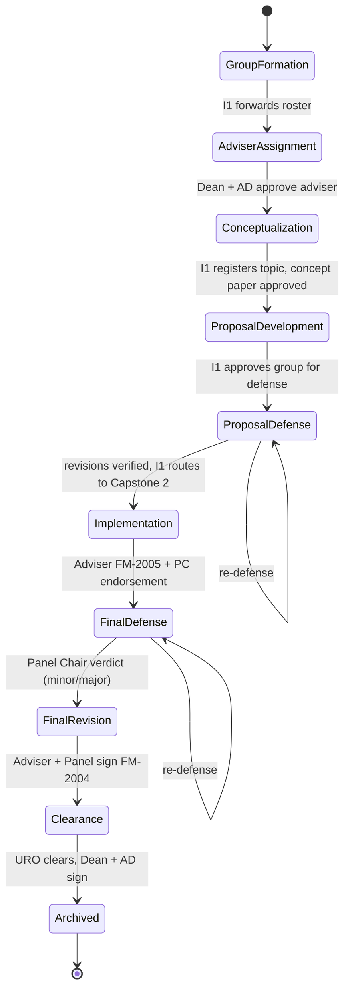

# Workflow Map — Roles, Stages, and Cross-Role Interactions (CAAC)

**Project:** Development of a Web-Based Thesis and Capstone Project Management and Workflow Automation System for HAU-SOC
**Built from:** finalized proposal manuscript + Capstone 2 knowledge base (Users and Permissions, Features, Decisions, Open Questions, Terminology) — 2026-09-29
**Purpose:** a step-by-step reference for polishing and testing the mockup one stage and one role at a time, including what each action changes on *other* users' screens.

### Legend
- No marker = **Confirmed** in the manuscript / knowledge base.
- **(inferred)** = reasonable reading of the manuscript, not stated outright.
- **[NEEDS CONFIRMATION → OQ#n]** = unresolved; `OQ#n` = item in `Open Questions.md`. `NEW-n` = gap found while building this map (listed in §8).
- **Mockup default** = a placeholder so the mockup can be built now. It is *not* a team decision — swap it once the question is settled.

---

## 1. How to use this with Claude Code

Polish one stage (§3) at a time. For every step, check five things:

1. **Actor screen** — the right role sees the action, in the right place, with the right label.
2. **CAAC guard** — the button exists only when role + project + stage allow it; every other role gets no button (or a read-only view). Hiding the button is not enough: the mock service/function must also reject the call.
3. **State change** — the project/document/form status updates exactly as the "Result" column says.
4. **Reflection** — log in as each role in the "Reflects on" column and confirm the change appears live (queues, badges, timelines, empty states).
5. **Side effects** — email (mocked: toast or outbox list), audit-log entry, workflow-history entry.

Suggested build order: §2 model → §3 stages S0–S10 → §5 queue check → §6 CAAC tests.

---

## 2. The CAAC model the mockup should implement

### 2.1 Roles

| Global Roles (institutional) | Project-Based Roles (per project) |
|---|---|
| Student | Instructor 1 (Thesis/Capstone 1) |
| Dean | Instructor 2 (Thesis/Capstone 2) |
| Associate Dean | Adviser |
| Program Chair/Coordinator | Panel Member |
| University Research Office (URO) | Panel Chair (= Panel Member + verdict) |
| System Administrator | |

Note: there is no plain "Faculty" Global Role. A faculty member who is only an Adviser/Panel Member has no Global Role in the manuscript's list. **[NEEDS CONFIRMATION → NEW-1]** — *Mockup default:* add a base `Faculty` global identity with no global permissions.

### 2.2 How a permission is decided

Every check uses three inputs: the user's **Global Role**, the user's **Project-Based Role(s) on this project**, and the project's **current stage** (state-based progressive visibility).

```
canView(user, project) =
     user is a PROJECT_MEMBER of project                                   // students
  OR user has a project role on project whose phase is currently active   // faculty hats (access after the phase ends → NEW-6)
  OR (user.globalRole in [Dean, AssocDean, ProgramChair, URO]
      AND project is formally approved
      AND project.stage involves that global role)
  OR user.globalRole == SystemAdministrator                                // config/audit only, no manuscript review

canDo(user, action, project) =
     canView(user, project)
  AND action ∈ allowedActions(roleHat, project.stage, documentState)
```

- **Writes** go through Cloud Functions that check `CAAC_permissions`; **reads** go through Firestore Security Rules. The manuscript also says "all CRUD through Cloud Functions" — **[CONFLICTING → OQ#1]**. For the mockup: route every action through one guard function so it can later map to either design.
- **Mock user shape (suggestion, not the schema):**
  ```js
  { id, name, email, globalRole: 'ProgramChair' | 'Faculty' | ...,
    projectRoles: { [projectId]: ['Adviser'] | ['PanelChair'] | ['Instructor1'] ... } }
  ```
  The real source of truth (`USER_ROLE.project_id` vs `PROJECT_ASSIGNMENT`) is **[NEEDS CONFIRMATION → OQ#5]**.
- **Multi-hat dashboard (inferred UX):** one faculty dashboard, projects grouped by hat ("Advising", "Panel", "Instructor", plus a global-role section such as "Program Chair queue"). The same project can never show actions from a hat the user doesn't hold on *that* project.

---

## 3. Master workflow (stage by stage)

### 3.0 Stage machine



Conflicts in this machine:
- The `PROJECT.current_stage` enum orders **Conceptualization → Adviser Assignment**, but the process assigns the adviser *before* ideation. **[CONFLICTING → OQ#9]** — *Mockup default:* the order above, with a separate "Group Formation" step (or treat "Conceptualization" as group formation and rename).
- There is no "Proposal Revision" stage in the enum, although the proposal defense also produces a verdict and revisions (inferred from `DEFENSE.defense_type`). **[NEEDS CONFIRMATION → NEW-3]** — *Mockup default:* keep the project in `Proposal Defense` with a revision sub-status.

### Step-table columns
**ID · Actor (hat) · Action → screen · Precondition · Result (state change) · Reflects on (who sees what) · Email**

---

### S0 — Accounts and access (before any project)

| ID | Actor | Action | Precondition | Result | Reflects on | Email |
|---|---|---|---|---|---|---|
| S0.1 | Any user | Register with `@hau.edu.ph` / `@student.hau.edu.ph` | Allowed domain | Account created, not yet active (inferred) | Sys Admin: user list / pending | Verification email with approval button |
| S0.2 | User | Click verification button | S0.1 | Email verified | Sys Admin list updates | — |
| S0.3 | Sys Admin | Verify/activate account; assign Global Role (Dean, AD, PC, URO) | S0.2 | `CAAC_permissions` updated; audit log | User's dashboard changes to match role | — |
| S0.4 | Any user | Log in | Active account | JWT with role claims; role dashboard loads | — | — |

- Self-verification vs admin approval vs both: **[NEEDS CONFIRMATION → OQ#4]**. *Mockup default:* both — email verification, then Sys Admin assigns non-student Global Roles.
- `authTriggers.js` assigns permissions on registration (inferred: `@student` → Student; `@hau.edu.ph` → Faculty with no global role until S0.3).
- Blocked: non-HAU domain → rejected at registration (negative test).

---

### S1 — Group Formation (Thesis/Capstone 1)

| ID | Actor | Action | Precondition | Result | Reflects on | Email |
|---|---|---|---|---|---|---|
| S1.1 | Instructor 1 | Create groups for a block; assign students | I1 assigned to the block **[NEEDS CONFIRMATION → OQ#5: who assigns I1?]** | `PROJECT` + workflow record (atomic); `PROJECT_MEMBER` rows | Students: group workspace appears (members, no topic, no adviser yet) (inferred) | Students notified (inferred) |
| S1.2 | Instructor 1 | Forward block roster to Program Chair/Coordinator | All groups filled | Stage → Adviser Assignment | PC: roster appears in "Needs adviser" queue. I1: groups show "Awaiting adviser" | PC ("following the endorsement of Instructor 1" — **which endorsement is ambiguous → NEW-8**) |

- Students cannot form their own groups (Dean's instruction).
- Year level / block section aren't on `USER` (OQ#11) — the mockup roster may need them anyway.

---

### S2 — Adviser Assignment

| ID | Actor | Action | Precondition | Result | Reflects on | Email |
|---|---|---|---|---|---|---|
| S2.1 | Program Chair/Coordinator | Assign an Adviser to each group | S1.2 | Adviser assignment pending approval | Dean + AD: "Adviser assignments to approve" queue. PC: "Submitted" | Dean + AD |
| S2.2 | Dean and Associate Dean | Approve adviser assignment | S2.1 | Assignment confirmed; stage → Conceptualization | Adviser: group appears under "Advising". Students: adviser name shown. I1: sees final adviser | Students ("adviser appointed"); Adviser (inferred — "New Assignment" event) |

Open points:
- Both must approve, either one, or in sequence? **[NEEDS CONFIRMATION → NEW-7]** — *Mockup default:* both, any order.
- Reject/return path (Dean returns to PC)? Not described **[NEW-7]**.
- Adviser accept/decline (`PROJECT_ASSIGNMENT.status` Pending/Accepted/Declined)? **[OQ#5]** — *Mockup default:* no accept step.
- The Dean is also an Adviser in real life: can the Dean approve an assignment naming themself? **[NEW-5]**

---

### S3 — Conceptualization (topics and concept paper)

| ID | Actor | Action | Precondition | Result | Reflects on | Email |
|---|---|---|---|---|---|---|
| S3.1 | Student | Submit five proposed topics | Adviser confirmed | Topic proposal v1 | I1 + Adviser: review queue badge | I1 (title proposals); Adviser (inferred) |
| S3.2 | Instructor 1 / Adviser | Comment, request revision | S3.1 | Status For Revision | Student: comments + "Revise" CTA | Student (revision request) |
| S3.3 | Instructor 1 | Approve one topic / reject others | S3.1 (Adviser input — inferred) | Topic approved | Student + Adviser: approved topic shown | Student (approved) |
| S3.4 | Instructor 1 | Officially register the approved topic | S3.3 | `PROJECT.title` set | All members + Adviser: project title everywhere | — |
| S3.5 | Student | Upload concept paper (PDF) | S3.4 | `DOCUMENT` Concept Paper vN (immutable) | I1 + Adviser: queue | I1 (concept paper) |
| S3.6 | Instructor 1 / Adviser | Annotate (non-destructive); return or approve | S3.5 | For Revision → student uploads vN+1 (old = Superseded), or Approved → stage Proposal Development | Student: annotations + version history | Student |

- Approval authority: role text says **I1 approves/rejects**; process says evaluated by **both** I1 and Adviser (inferred: I1 is the gate, Adviser reviews).
- Consultations stay outside the system (Decision 22).

---

### S4 — Proposal Development

| ID | Actor | Action | Precondition | Result | Reflects on | Email |
|---|---|---|---|---|---|---|
| S4.1 | Student | Upload chapter drafts / proposal manuscript | Concept paper approved | `DOCUMENT` Proposal Manuscript vN | I1 + Adviser queues | I1 (chapter drafts); Adviser (manuscript drafts) |
| S4.2 | Instructor 1 / Adviser | Annotate; return for revision | S4.1 | New version loop | Student: annotations per version; version compare | Student |
| S4.3 | Instructor 1 | Approve group to present proposal defense | Manuscript ready (Adviser agrees — inferred) | Stage → Proposal Defense | PC: "Needs panel" queue | PC (possibly the "Instructor 1 endorsement" — NEW-8) |

- Weekly log (FM-AAC-SOC-2003) is also used for consultations in Capstone 1 per the current process, but the system feature is described for Capstone 2. **[NEEDS CONFIRMATION → NEW-9]**

---

### S5 — Proposal Defense

*The manuscript details the final defense much more than the proposal defense. Steps marked (inferred) mirror the final defense.*

| ID | Actor | Action | Precondition | Result | Reflects on | Email |
|---|---|---|---|---|---|---|
| S5.1 | Program Chair/Coordinator | Assign Panel Chair + Panel Members | S4.3 | Panel assignments | Panel: project appears under "Panel" (latest version only) | Panel ("assigned to a panel") |
| S5.2 | **? (PC / I1 / I2)** | Create proposal defense schedule | S5.1 | `DEFENSE` (Proposal) | Students, Adviser, Panel: date/time/venue/link | Students + Panel |
| S5.3 | Student | Submit complete proposal manuscript + presentation video link | Scheduled | `DOCUMENT` vN; triggers AI summary | Panel queue | Panel (manuscript/video uploaded) |
| S5.4 | System | Generate Gemini summary of the complete manuscript, with disclosure label | S5.3, proposal milestone | `AI_SUMMARY` | **Who sees it → OQ#2** | — |
| S5.5 | Panel Member / Chair | Private annotations | S5.3 | Annotation (private) | Author only — not other panelists, not students, not Adviser (inferred) | — |
| S5.6 | Panel Chair | Record verdict via FM-AAC-SOC-2004 (inferred for proposal) | Defense held | Verdict + revision deadline | Students: verdict, required revisions, countdown | Students (inferred) |
| S5.7 | Student → Adviser → Panel | Revise, Adviser verifies, Panel verifies and signs FM-2004 (inferred) | S5.6 | Revisions completed | Each party's queue in turn | Each next actor (inferred) |
| S5.8 | Instructor 1 | Approve routing to Capstone 2 | S5.7 | Stage → Implementation; Instructor 2 attached **[who assigns I2 → OQ#5]** | I2: project appears. I1: read-only or gone? **[NEW-6]** | I2 (inferred) |

- S5.2: Table 1 gives defense scheduling to **Instructor 2 + PC** "for proposal and final defenses", but Instructor 2 belongs to Capstone 2; DFD 6.0 says the PC enters the "title defense" schedule. **[CONFLICTING → NEW-2, OQ#7]** — *Mockup default:* PC schedules the proposal defense.
- S5.4 trigger: automatic on submission, or a "Generate summary" button for reviewers? **[NEEDS CONFIRMATION → NEW-4]** — *Mockup default:* automatic when a complete manuscript is submitted at a defense milestone.
- S5.4 audience — *Mockup default:* Adviser + Panel (DFD 4.0), behind one config flag so it's easy to change.
- Same panel for proposal and final defense? **[NEW-6]**

---

### S6 — Implementation (Thesis/Capstone 2)

| ID | Actor | Action | Precondition | Result | Reflects on | Email |
|---|---|---|---|---|---|---|
| S6.1 | Student | Submit weekly accomplishment (FM-AAC-SOC-2003) | Stage Implementation | `WEEKLY_ACCOMPLISHMENT` Submitted | Adviser: "Logs to sign" badge | Adviser |
| S6.2 | Adviser | Approve + e-sign, or return | S6.1 | Approved (+ signature) / Returned | Student: log status; I2: progress view (inferred) | Student (inferred) |
| S6.3 | Student | Upload manuscript drafts | — | `DOCUMENT` vN | Adviser queue | Adviser |
| S6.4 | Adviser | Annotate; return | S6.3 | Version loop | Student | Student |
| S6.5 | Instructor 2 | Confirm milestones (revised manuscript, system components) | — | Milestone flags | Student, Adviser | — |
| S6.6 | Student | Submit deployment information | — | Not modeled in the data dictionary **[OQ#12]** | Adviser, I2 | — |
| S6.7 | Adviser (+ I2 readiness check) | Submit digital Capstone Recommendation Form FM-AAC-SOC-2005 | Adviser and I2 verify readiness | Form signed | PC: "Recommendations to endorse" | PC |
| S6.8 | Any member | Export FM-AAC-SOC-2003 logs | Logs exist | File export | — | — |

- Instructor 2 **cannot annotate** (no annotation tools in the UI; the guard rejects it).
- DFD 5.0 says Instructor 2 does "sign-offs" on progress; role text says the Adviser signs logs. **[CONFLICTING → OQ#7]** — *Mockup default:* Adviser signs; I2 confirms milestones.

---

### S7 — Final Defense

| ID | Actor | Action | Precondition | Result | Reflects on | Email |
|---|---|---|---|---|---|---|
| S7.1 | Program Chair/Coordinator | Formal endorsement for defense scheduling | S6.7 | Endorsed | I2: "Create schedule" becomes enabled | I2 (inferred: "this approval") |
| S7.2 | Program Chair/Coordinator | Assign Panel Chair + Panel Members | — | Panel assignments | Panel: project appears | Panel |
| S7.3 | Instructor 2 | Create and publish final-defense schedule | S7.1 | `DEFENSE` (Final) | Students, Adviser, Panel | Students + Panel |
| S7.4 | Student | Upload final manuscript + video link | Scheduled | `DOCUMENT` vN; AI summary (S5.4 rules) | Panel sees **latest version only** | Panel |
| S7.5 | Panel Member / Chair | Private annotations | S7.4 | Private notes | Author only | — |
| S7.6 | Panel Chair | Record verdict via FM-AAC-SOC-2004: minor / major revisions / re-defense | Defense held | Verdict; countdown starts (minor 7 days, major 14 days — configurable) | Students: verdict + deadline timer. Adviser/Panel/I2: status (inferred) | Students (inferred); "Defense Scheduled" / revision events |
| S7.7 | — | Re-defense | S7.6 = re-defense | Back to S7.3 after revisions | All | — |

- Only the Panel Chair can record the verdict (negative test: Panel Member tries).
- Verdict values differ: data model "Passed / Passed w/ Minor / Passed w/ Major / Failed" vs narrative "minor / major / re-defense". **[CONFLICTING → OQ#10]** — *Mockup default:* Minor revisions, Major revisions, Re-defense.
- When panel notes become visible to students/others after the verdict: **[OQ#3]** — *Mockup default:* released to students when the verdict is recorded; never shared between panelists.

---

### S8 — Final Revision

| ID | Actor | Action | Precondition | Result | Reflects on | Email |
|---|---|---|---|---|---|---|
| S8.1 | Student | Upload revised manuscript | Countdown running | `DOCUMENT` vN+1 | Adviser queue | Adviser (post-defense revisions) |
| S8.2 | System | Flag overdue | Deadline passed, not completed | `revision_status` Overdue | Student + Adviser (+ I2/PC — inferred) see red flag | Overdue Revision |
| S8.3 | Adviser | Verify revisions against panel requirements; forward to panel | S8.1 | Adviser verified | Panel: "Revisions to verify" | Panel (inferred) |
| S8.4 | Panel Members + Chair | Verify and sign FM-AAC-SOC-2004 | S8.3 | All signed → `revision_status` Completed; stage → Clearance | Students: "Proceed to clearance" | Students (inferred) |
| S8.5 | Instructor 2 | Confirm post-defense course requirements | — | Confirmed | Students, Adviser | — |

---

### S9 — Clearance

| ID | Actor | Action | Precondition | Result | Reflects on | Email |
|---|---|---|---|---|---|---|
| S9.1 | Student | Upload Editor's Certificate | Adviser + Panel approved the manuscript | `DOCUMENT` Editor's Certificate | URO later (S9.4) | — |
| S9.2 | Student | Upload Plagiarism Clearance Certificate | Same | `DOCUMENT` Plagiarism Certificate | URO later | — |
| S9.3a | Adviser | Sign Approval Sheet | S9.1–S9.2 (inferred) | Signature 1 | Panel: "Approval Sheet to sign" | Panel (inferred) |
| S9.3b | Panel Members + Chair | Sign Approval Sheet | S9.3a | Panel signatures | PC queue | PC ("after the whole panel signs") |
| S9.3c | Program Chair/Coordinator | Endorse (not the final signatory) | S9.3b | Endorsed | URO queue | URO **[not stated]** |
| S9.4 | URO | Verify certificates + manuscript; sign/clear ("First and Second Level" routing) | S9.3c | URO cleared | Dean + AD: project appears **for the first time in their final-approval queue** | Dean + AD ("fully cleared project endorsed") |
| S9.5 | Dean and Associate Dean | Sign Approval Sheet; final approval | S9.4 | Stage → Archived; status Completed | Students: "Completed". Records table updated | Students (inferred) |

- URO "First and Second Level" review isn't defined anywhere. **[NEEDS CONFIRMATION → NEW-10]** — *Mockup default:* one URO verify step.
- URO rejection path (e.g., invalid certificate → back to student)? **[NEW-7]** — *Mockup default:* "Return to group" with remarks.
- Whether the URO signs the Approval Sheet itself or a separate form: not explicit.

### S10 — Archived

| ID | Actor | Action | Reflects on |
|---|---|---|---|
| S10.1 | Dean / Associate Dean | Search and filter records tables | — |
| S10.2 | System Administrator | Manage archive; retention for graduated cohorts | — |
| S10.3 | Dean, AD, PC, Sys Admin | Generate/export reports (status, completion rates, faculty workload) | — |

Public archive/gallery is not in the manuscript **[OQ#6]**.

---

## 4. Per-role view (what to polish on each role's screens)

Step IDs refer to §3.

### Student (Global)
- **Dashboard:** own group only — current stage, what's waiting on them, deadlines/countdown, latest verdict, adviser and panel names. **No in-app notification list: notifications are sent by email only** (team decision 2026-09-29; `NOTIFICATION` is the email log).
- **Actions:** S3.1, S3.5, S4.1, S5.3, S5.7, S6.1, S6.3, S6.6, S6.8, S7.4, S8.1, S9.1, S9.2.
- **Sees:** own documents + version history, reviewer annotations (not private panel notes before the verdict — OQ#3), AI summary only if OQ#2 says so.
- **Never:** approve any gate, edit/delete a submitted file, see other groups.
- **Empty state:** registered but not yet in a group.
- **Emails:** approved, revision requested, adviser appointed, defense scheduled, overdue.

### Instructor 1 (Project-Based)
- **Dashboard:** block roster, groups by stage, review queue (topics, concept papers, drafts).
- **Actions:** S1.1, S1.2, S3.2–S3.4, S3.6, S4.2, S4.3, S5.8.
- **Can annotate.** After S5.8: read-only or no access **[NEW-6]**.
- **Emails:** concept papers, chapter drafts, title proposals submitted.

### Instructor 2 (Project-Based)
- **Dashboard:** Capstone 2 groups, milestones, readiness, schedules.
- **Actions:** S6.5, S6.7 (readiness check), S7.3 (after S7.1), S8.5.
- **Cannot annotate.** Cannot schedule before PC endorsement.
- **Emails:** PC endorsement (inferred).

### Adviser (Project-Based)
- **Dashboard ("Advising"):** assigned groups, drafts to review, logs to sign, revisions to verify, forms to sign.
- **Actions:** S3.2, S3.6, S4.2, S6.2, S6.4, S6.7, S8.3, S9.3a.
- **Can annotate; cannot edit student files.** Cannot see panelists' private notes.
- **Emails:** weekly logs, manuscript drafts, post-defense revisions submitted.

### Panel Member (Project-Based)
- **Dashboard ("Panel"):** assigned projects, schedule, latest manuscript version, AI summary, revisions to verify, forms to sign.
- **Actions:** S5.5, S5.7, S7.5, S8.4, S9.3b.
- **Private notes only. Cannot record verdict.** Sees latest version only.
- **Emails:** assigned to panel; manuscript/video uploaded.

### Panel Chair (Project-Based)
- Everything a Panel Member has, **plus** S5.6 and S7.6 (verdict via FM-AAC-SOC-2004).

### Program Chair/Coordinator (Global)
- **Dashboard:** "Needs adviser", "Needs panel", "Recommendations to endorse", "Approval Sheets to endorse", program-level progress, reports.
- **Actions:** S2.1, S5.1, (S5.2 mockup default), S7.1, S7.2, S9.3c, S10.3.
- **Never:** final executive signature.
- **Emails:** I1 endorsement, FM-2005 submitted, panel finished signing the Approval Sheet.
- Tension: progressive visibility says admins see a project only when a phase involves them, but PC also "monitors program-level progress" and reports faculty workload. **[NEW-11]** — *Mockup default:* PC sees program-level summary counts/status for all projects, but opens project documents only when a PC step is active.

### Dean and Associate Dean (Global)
- **Dashboard:** "Adviser assignments to approve", "Projects for final approval", records tables, reports.
- **Actions:** S2.2, S9.5, S10.1, S10.3.
- **Visibility:** a project appears only at S2.2 and again after URO clearance (S9.4). Same NEW-11 tension for reports.
- **Emails:** adviser assignment submitted; fully cleared project endorsed.

### University Research Office (Global)
- **Dashboard:** "Clearances to verify" (certificates + manuscript).
- **Actions:** S9.4 (+ return path, NEW-7).
- **Emails:** not stated.

### System Administrator (Global)
- **Dashboard:** users/accounts, role and CAAC tag assignments, permission overrides, global settings (countdown length here is inferred — the FR only says "configurable"), archive, activity/audit logs, reports.
- **Actions:** S0.3, S10.2, S10.3.
- **Never:** review or annotate manuscripts.

---

## 5. "Whose turn is it?" — queue ownership per stage

Use this to check that every dashboard shows the project in the right place at the right time.

| Stage | Waiting on | Everyone else sees |
|---|---|---|
| Group Formation | Instructor 1 | Students: group, "awaiting adviser" |
| Adviser Assignment | PC → Dean + AD | I1 + Students: "awaiting adviser" |
| Conceptualization | Students ⇄ I1 + Adviser | — |
| Proposal Development | Students ⇄ I1 + Adviser | — |
| Proposal Defense | PC (panel, schedule) → Students (submit) → Panel Chair (verdict) → Students/Adviser/Panel (revisions) → I1 (route) | Panel sees project only from S5.1 |
| Implementation | Students ⇄ Adviser (logs, drafts); I2 (milestones); Adviser (FM-2005) | PC not involved until FM-2005 |
| Final Defense | PC (endorse, panel) → I2 (schedule) → Students (submit) → Panel Chair (verdict) | — |
| Final Revision | Students → Adviser → Panel | Countdown visible to Students + Adviser (+ others — inferred) |
| Clearance | Students (certs) → Adviser → Panel → PC → URO → Dean + AD | Dean/AD see project only after URO |
| Archived | — | Records table (Dean/AD), archive (Sys Admin) |

---

## 6. CAAC test personas (seed data for the mockup)

Designed so one login exercises several hats. Names are placeholders.

| Persona | Global Role | Project hats |
|---|---|---|
| **Prof. Alpha** | Program Chair/Coordinator | Adviser of G1; Panel Chair of G2 |
| **Prof. Bravo** | Faculty (NEW-1) | Instructor 1 of block A (G1, G2); Panel Member of G3 |
| **Prof. Charlie** | Faculty | Adviser of G2; Panel Member of G1; Instructor 2 of G3 |
| **Dean Delta** | Dean | Adviser of G3 (mirrors the real Adviser-is-Dean situation) |
| **AD Echo** | Associate Dean | Panel Member of G2 |
| **URO Uniform** | URO | — |
| **Admin Sierra** | System Administrator | — |
| Students | Student | G1 (3 students, early stage), G2 (proposal defense), G3 (final revision/clearance), 1 student with no group |

Put G1, G2, G3 at different stages so every queue in §5 has data.

---

## 7. CAAC test scenarios

For each one, check **both** the UI (button hidden/disabled, no data leaked) **and** the guard (a forced call is rejected).

| # | Log in as | Do / look at | Expected |
|---|---|---|---|
| T1 | Prof. Alpha | G1 manuscript | Can annotate, sign logs (Adviser hat) |
| T2 | Prof. Alpha | G2 | Can record verdict (Panel Chair); **no** adviser actions |
| T3 | Prof. Alpha | G3 | Not visible as faculty; appears only in PC queues when a PC step is active |
| T4 | Prof. Charlie | G1 notes before the defense | Private — Prof. Alpha (G1 Adviser) and G1 students can't see them |
| T5 | Prof. Charlie | G1 verdict button | Not available (Panel Member only) |
| T6 | Prof. Charlie | G3 as Instructor 2 | No annotation tools anywhere |
| T7 | Prof. Charlie | G3 schedule before PC endorsement | "Create schedule" disabled |
| T8 | Dean Delta | G3 | Full Adviser view from the start |
| T9 | Dean Delta | G1 / G2 as Dean | Visible only at adviser approval (S2.2) and after URO clearance (S9.4) |
| T10 | Prof. Alpha | Approval Sheet | Can endorse; **cannot** give final signature |
| T11 | Dean Delta | Final signature on G3 before URO clears | Blocked |
| T12 | URO Uniform | G3 before PC endorsement | Not in queue / blocked |
| T13 | Any student | Other groups; any approve button; re-upload over an old version | None visible; new upload creates vN+1, never overwrites |
| T14 | Student with no group | Dashboard | Empty state, no project data |
| T15 | Panel Member | Older manuscript versions | Only latest version shown |
| T16 | Prof. Alpha (as Program Chair/Coordinator) | Remove Prof. Charlie from G1 panel | G1 disappears from Charlie's dashboard live; audit log entry (panel assignment is the PC's job; Sys Admin only handles permission overrides) |
| T17 | Adviser | Double-click "Approve" | One approval recorded (no duplicates — Reliability NFR) |
| T18 | — | Let G3's countdown expire | Overdue flag + notification |
| T19 | Prof. Alpha | Assign themself as Panel Member of G1 (where they're Adviser) | Depends on NEW-5 — test whatever the team decides |
| T20 | Admin Sierra | Try to open/annotate a manuscript | Blocked |
| T21 | Any action above | Audit log / workflow history | Entry with actor, role hat, before/after |

---

## 8. Gaps found while mapping (to settle with the team or Adviser)

Already in `Open Questions.md`: **OQ#1** (CAAC read path), **OQ#2** (AI summary audience), **OQ#3** (panel note visibility), **OQ#4** (account verification), **OQ#5** (who assigns I1/I2; accept/decline), **OQ#7** (who submits/signs which forms), **OQ#9** (stage order), **OQ#10** (verdict values), **OQ#11** (year level/block), **OQ#12** (annotation position/visibility fields, deployment info, video links).

New from this mapping:

| ID | Gap |
|---|---|
| NEW-1 | No plain "Faculty" Global Role — what global identity does an Adviser-only faculty member have? |
| NEW-2 | Who schedules the **proposal** defense (PC, I1, or I2)? |
| NEW-3 | No proposal-revision stage in the `current_stage` enum. |
| NEW-4 | AI summary trigger: automatic on submission, or on request by a reviewer? |
| NEW-5 | Conflict-of-interest rules: can one person hold two hats on the same project (e.g., Adviser + Panel Member)? Can the Dean approve their own adviser assignment? |
| NEW-6 | Does Instructor 1 keep read access after Capstone 1? Is the final-defense panel the same as the proposal panel? |
| NEW-7 | Reject/return paths: Dean/AD rejecting an adviser assignment; URO rejecting a certificate. Also: do both Dean and AD have to approve, or either? |
| NEW-8 | "PC notified following the endorsement of Instructor 1" — endorsement of the roster (S1.2) or of proposal-defense readiness (S4.3)? |
| NEW-9 | Is the weekly log (FM-AAC-SOC-2003) active in Capstone 1 too, or only Capstone 2? |
| NEW-10 | What are URO "First and Second Level" reviews? |
| NEW-11 | Progressive visibility vs program-level monitoring/reports for PC, Dean, AD — how much can they see outside their active steps? |

---

## 9. Obsolete or out of scope — remove from the mockup if present

These are dropped (Capstone 1 ideas that were reversed), out of scope in the finalized manuscript, or leftovers in the manuscript's own diagrams. None of them belong in the workflow above. If the mockup still has any of them, remove or disable them.

### Dropped in Capstone 1 (superseded)
| Don't build | Current rule | Source |
|---|---|---|
| OTP verification at registration | Domain-restricted registration + email verification button | Decision 12 |
| Public "Colloquium Gallery" / public archive with abstracts | Records-table archive for Dean/AD only — **but the Dean asked for a public archive; still open** | OQ#6 |
| Grading, scores, rubric scoring | No grade computation | Decision 23 |
| Students creating their own groups | Instructor 1 creates groups | Decision 17 |
| Instructor 1 / Instructor 2 as Global Roles | Project-Based Roles | Decision 15 |
| Routing order "… → Dean → URO" | URO verifies **before** the Dean's final signature | Decision 18 |
| "Signatures stay manual" | Digital signatures on forms | Decision 19 |

### Out of scope (finalized manuscript)
No chat or messaging module · no in-app manuscript editing · no team task board or Kanban · no tracking of who edited what · no plagiarism-checker integration (students upload certificates) · no video uploads (external links only) · no IRB workflow · no URO co-authorship forms (FM-AAC-URO-2001, 2014–2017 — only the FM-AAC-SOC-2003 export) · no in-app consultation scheduling or logs beyond the weekly log · no faculty publication/KPI features · no native mobile app.

### Leftovers in the manuscript that contradict the rules above
| Leftover | Where | Why it's obsolete | Action |
|---|---|---|---|
| `EVALUATION_FORM` entity ("individual evaluation of each panel member") | ERD / Data Dictionary I-12 | Looks like a remnant of panel grading (Decision 23). The workflow has no per-panelist evaluation step — only private annotations, the Chair's verdict, and FM-2004 signatures | Don't build an evaluation/rubric screen. **[NEEDS CONFIRMATION → NEW-12]**: drop the entity, or define it as something that isn't a grade |
| "rubric evaluations … supplied by the Panel Chair and Panel Members" | Level-0 DFD 6.0 | Same — no grading | Remove from the DFD text (already OQ#18) |
| "the Student sends the topic proposal along with group details" | Level-0 DFD 2.0 | Students don't form or register groups | Students submit topics only; group details come from Instructor 1. **NEW-13** |
| "approval validations … submitted by Instructor 2" in final clearance | Level-0 DFD 7.0 | Instructor 2 isn't a clearance signatory | Keep I2 to milestone and post-defense requirement confirmation (OQ#7) |
| PRD v1.1 (OTP, Colloquium Gallery, Dean → URO) | Possibly Appendix E | Conflicts with the manuscript body | Check which PRD version is in Appendix E (OQ#16) |

New gaps from this check:

| ID | Gap |
|---|---|
| NEW-12 | Is `EVALUATION_FORM` still needed? If not, remove it from the ERD and data dictionary (17 → 16 entities; the "seventeen entities" sentence on p. 55 would change too). |
| NEW-13 | DFD 2.0 says students send "group details" — align it with Instructor 1 creating groups. |

---

## 10. Prompt template for Claude Code

> Read `WORKFLOWS.md`. We're polishing **stage S{n}** of the mockup. For each step in S{n}: (1) find the screen/component for the actor, (2) make sure the action is guarded by role hat + project + stage per §2.2, (3) apply the state change in the mock data, (4) make the change appear for every role in "Reflects on", (5) add the mock email and audit-log entry. Use the §6 personas. Then run the §7 scenarios that touch S{n} and report which pass. Where the doc says "Mockup default", implement it behind a clearly named config flag.
